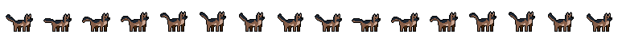
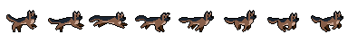
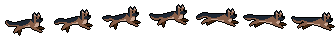
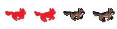
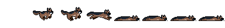
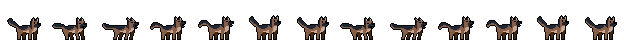
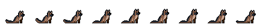
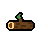

<h1 align="center">🐕 Zoomies</h1>

<p align="center">
  <b>A retro 2D endless runner built with SpriteKit + Swift 🕹️</b><br>
  Run, jump, collect bones, and survive as long as you can!
</p>

<p align="center">
  
  
  
  
</p>

---

## 🧠 Overview

**Zoomies** is a fast-paced 2D pixel-art endless runner starring a loyal German Shepherd 🐶.  
Tap to jump, collect bones to restore health, and dodge logs to keep running!  
The game combines **retro pixel art**, **parallax backgrounds**, and **smooth SpriteKit animation** for an old-school arcade vibe.

---

## 🎮 Gameplay Demo

### 🌅 Intro Scene  
<p align="center">
  <b>Our hero gets ready for a new adventure!</b><br><br>
  
</p>


---

### 🏃‍♂️ Gameplay  
<p align="center">
  <b>Dodge logs, collect bones, and keep running to survive!</b><br><br>
  
</p>


- **Dynamic obstacles** (logs) and **collectibles** (bones)  
- Bones restore hearts if health < 5 ❤️  
- **Real-time distance tracker** in the bottom-right  
- **Smooth jump animation** and parallax-scrolling background

---

### 🎛️ Menu System  
<p align="center">
  <b>Pause, check the rules, or view the credits anytime.</b><br><br>
  
</p>


- In-game **pause menu** with Resume, Rules, Credits, and Exit  
- **Rules and Credits pages** with their own animations  

---

### 💀 Game Over  
<p align="center">
  <b>Every run must end — but you can always play again!</b><br><br>
  
</p>

- **Yes / No** restart options with proper input detection  

---

## 🧰 Tech Stack

| Layer | Technology |
|:------|:------------|
| Engine | SpriteKit |
| Language | Swift |
| IDE | Xcode |
| Art | Custom Pixel Sprites (created using [Pixilart](https://www.pixilart.com)) |
| Font | Press Start 2P |
| Platform | iOS |

---
<details>
<summary><b>🎨 Full Asset Reference (click to expand)</b></summary>
<br>

# 🧾 Zoomies – Sprite & Asset Reference Sheet  

All artwork was created by **Ritika Joshi** using [Pixilart](https://www.pixilart.com)  
and is **not licensed for commercial reuse or redistribution**.  
All assets are stored in **`Assets.xcassets`**, organized by folders.

---

## 🐕 Character Sprites  

| Sprite | Description | Frames | Used In |
|:------:|:-------------|:-------:|:--------|
|  | Dog sitting + wagging tail (idle) | 16 | Title screen |
|  | Running animation | 8 | Gameplay |
|  | Jump animation | 7 | Gameplay |
|  | Hurt animation (flinch) | 4 | When hit |
|  | Death animation | 8 | When HP = 0 |
|  | Barking dog | 13 | Title screen |
|  | Sitting dog | 9 | Credits screen |

---

## 🪵 Obstacles & Collectibles  

| Sprite | Description | Used In |
|:------:|:-------------|:--------|
|  | Wooden log obstacle | Gameplay |
|  | Collectible bone | Gameplay |
|  | Blinking yellow bone effect | Bone collection |

---

## ❤️ UI Elements  

| Sprite | Description | Used In |
|:------:|:-------------|:--------|
|  | Player health unit | Health bar |
|  | Small cloud | Background |
|  | Medium cloud | Background |
|  | Large cloud | Background |


</details>

---

## 👩‍💻 Credits

**Zoomies** by [Ritika Joshi](https://github.com/RJoshi141)  
Game Design, Art & Code by Ritika  
Built with SpriteKit + Swift ✨  
© 2025 Zoomies Studio  

> 🎨 *All pixel art assets are creations by Ritika Joshi and are **not for commercial reuse or redistribution.***  

---

## ⚙️ Setup (for Developers)

Follow these steps to open, build, and run **Zoomies** locally:

### 1️⃣ Clone the repository
```bash
git clone https://github.com/RJoshi141/Zoomies.git
cd Zoomies
````

### 2️⃣ Open in Xcode

* Open **Zoomies.xcodeproj** in Xcode
* Ensure you’re running **Xcode 15 or newer** (Swift 5.9+)
* Set the active scheme to **Zoomies** and your simulator to any iPhone device

### 3️⃣ Run the Game

* Press **⌘ + R** (or Product → Run)
* The game launches in the iOS Simulator
* Tap anywhere to start running 🏃‍♀️

### 4️⃣ Optional: Customize Assets

* Modify textures or UI art in the **Assets.xcassets** folder
* Keep pixel scaling consistent and use `.nearest` filtering for crisp visuals
* To add new sprites, import your **.png** files and reference them in the `GameScene.swift`

---

## ⚖️ License

This project is licensed under the **MIT License** — see the [LICENSE](./LICENSE) file for details.
© 2025 Ritika Joshi

> 🧩 Code is open-source and free for educational use.
> 🎨 Pixel art and design assets are protected and **not for commercial distribution.**
