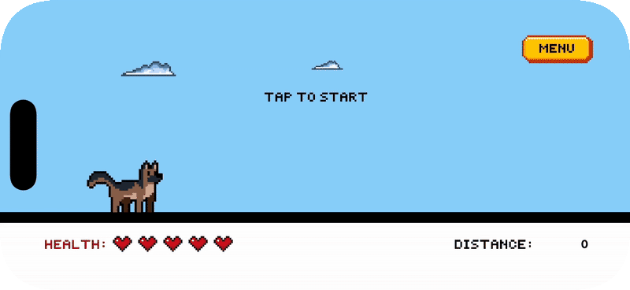
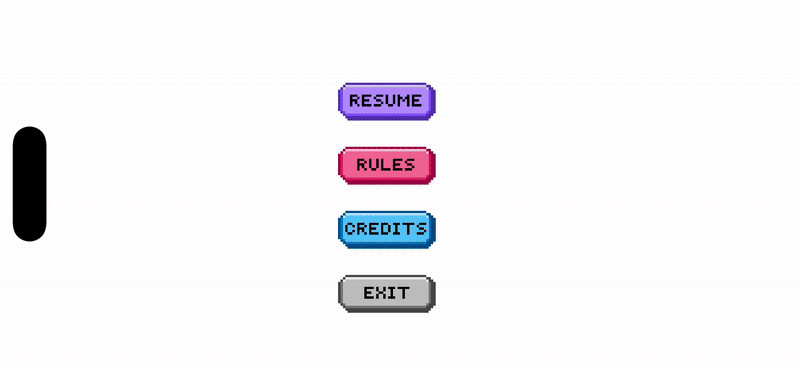
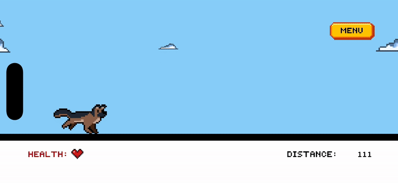

<h1 align="center">🐕 Zoomies</h1>

<p align="center">
  <b>A retro 2D endless runner built with SpriteKit + Swift 🕹️</b><br>
  Run, jump, collect bones, and survive as long as you can!
</p>

<p align="center">
  
  
  
  
</p>

---

## 🧠 Overview

**Zoomies** is a fast-paced 2D pixel-art endless runner starring a loyal German Shepherd 🐶.  
Tap to jump, collect bones to restore health, and dodge logs to keep running!  
The game combines **retro pixel art**, **parallax backgrounds**, and **smooth SpriteKit animation** for an old-school arcade vibe.

---

## 🎮 Gameplay Demo

### 🌅 Intro Scene  
<p align="center">
  <b>Our hero gets ready for a new adventure!</b><br><br>
  
</p>


---

### 🏃‍♂️ Gameplay  
<p align="center">
  <b>Dodge logs, collect bones, and keep running to survive!</b><br><br>
  
</p>


- **Dynamic obstacles** (logs) and **collectibles** (bones)  
- Bones restore hearts if health < 5 ❤️  
- **Real-time distance tracker** in the bottom-right  
- **Smooth jump animation** and parallax-scrolling background

---

### 🎛️ Menu System  
<p align="center">
  <b>Pause, check the rules, or view the credits anytime.</b><br><br>
  
</p>


- In-game **pause menu** with Resume, Rules, Credits, and Exit  
- **Rules and Credits pages** with their own animations  

---

### 💀 Game Over  
<p align="center">
  <b>Every run must end — but you can always play again!</b><br><br>
  
</p>

- **Yes / No** restart options with proper input detection  

---

## 🧰 Tech Stack

| Layer | Technology |
|:------|:------------|
| Engine | SpriteKit |
| Language | Swift |
| IDE | Xcode |
| Art | Custom Pixel Sprites (created using [Pixilart](https://www.pixilart.com)) |
| Font | Press Start 2P |
| Platform | iOS |

---

<details>
<summary><b>🎨 Full Asset Reference (click to expand)</b></summary>
<br>

# 🧾 Zoomies – Sprite & Asset Reference Sheet

All artwork was created by **Ritika Joshi** using [Pixilart](https://www.pixilart.com)  
and is **not licensed for commercial reuse or redistribution**.  
All assets are stored in **`Assets.xcassets`**, organized by folders.

---

## 🐕 Character Sprites

| Sprite Name | File | Description | Frame Count | Used In |
|:-------------|:------|:-------------|:-------------|:--------|
| 🐶 Idle Dog | `dog-idle-sprite.png` | Dog sits wagging tail; default state. | 16 | Title screen, pre-run idle animation |
| 🏃‍♂️ Running Dog | `dog-running-sprite.png` | Main running animation loop. | 8 | During gameplay |
| 🦘 Jumping Dog | `dog-jump-sprite.png` | Dog leaps upward; smooth jump arc. | 7 | Jump mechanic |
| 💢 Hurt Dog | `dog-hurt-sprite.png` | Dog flinches after log collision. | 4 | On damage |
| ☠️ Die Dog | `dog-die-sprite.png` | Dog collapses and stops running. | 8 | When health reaches 0 |
| 🦴 Bone Collected Dog | `dog-bone-collected-sprite.png` | Quick celebration frame (unused alternate). | 6 | (Optional bonus animation) |
| 🗣️ Barking Dog | `dog-bark-sprite.png` | Barking animation for title or credits screen. | 13 | Title screen |
| 🐾 Sitting Dog | `dog-sit-sprite.png` | Idle sitting dog used on the credits screen. | 9 | Credits scene |

---

## 🪵 Obstacles & Collectibles

| Sprite Name | File | Description | Used In |
|:-------------|:------|:-------------|:--------|
| Log | `wooden-log.png` | Wooden obstacle the dog must jump over. | Main gameplay |
| Bone | `dog-bone.png` | Collectible power-up that restores one heart. | Main gameplay |
| Bone (Yellow Blink) | `dog-bone-yellow.png` | Short blink effect when bone is collected. | Main gameplay |
| Bone Collected Sprite | `dog-bone-collected-sprite.png` | Older version of collection animation. | (Archived/Optional) |

---

## ❤️ Health & UI

| Sprite Name | File | Description | Used In |
|:-------------|:------|:-------------|:--------|
| Heart | `heart.png` | Standard heart representing one unit of health. | Health bar |
| Health Label | `health_label.png` | “HEALTH” text label for UI bar. | Bottom left of screen |
| Skull | `health-skull.png` | Appears when player dies (replaces first heart). | On death |
| Distance Label | `distance_label.png` | “DISTANCE” label in the HUD. | Bottom right of screen |

---

## 🖥️ UI Buttons & Menus

| Button | Normal | Clicked | Description | Used In |
|:--------|:--------|:---------|:-------------|:--------|
| Menu | `menu-button.png` | `menu-button-clicked.png` | Pauses gameplay and opens menu. | Always visible during gameplay |
| Resume | `resume-button.png` | `resume-button-clicked.png` | Returns to game from pause menu. | Menu overlay |
| Rules | `rules-button.png` | `rules-button-clicked.png` | Opens the rules page. | Menu overlay |
| Credits | `credits-button.png` | `credits-button-clicked.png` | Opens credits scene. | Menu overlay |
| Exit | `exit-button.png` | `exit-button-clicked.png` | Quits to title screen. | Menu overlay |
| Back | `back-button.png` | `back-button-clicked.png` | Returns to menu from Rules/Credits. | Rules/Credits pages |

---

## 🪩 Titles & Overlays

| Sprite Name | File | Description | Used In |
|:-------------|:------|:-------------|:--------|
| Zoomies Title | `zoomies-title.png` | Main title animation. | Title screen |
| Tap to Start | `tap-to-start-title.png` | Prompt shown before running starts. | Idle screen |
| Game Over | `game-over-title.png` | Appears when player dies. | Game over screen |
| Play Again | `play-again-title.png` | Shown under Game Over with Yes/No. | Game over screen |
| Rules Page | `menu-rules.png` | Page graphic for rules. | Rules scene |
| Credits Page | `menu-credits.png` | Page graphic for credits. | Credits scene |

---

## ☁️ Environment & Background

| Sprite Name | File | Description | Used In |
|:-------------|:------|:-------------|:--------|
| Cloud 1 | `cloud1.png` | Small cloud – random parallax spawn. | Background |
| Cloud 2 | `cloud2.png` | Medium cloud. | Background |
| Cloud 3 | `cloud3.png` | Large cloud. | Background |
| Road | (solid color node) | Black ground segment. | Gameplay area |
| Sky | (SKColor node) | Light blue background color. | Background |

---

## 🪄 Miscellaneous Assets

| Sprite Name | File | Description | Used In |
|:-------------|:------|:-------------|:--------|
| Skull Icon | `skull.png` | Decorative skull above “Game Over” text. | Game over screen |
| PressStart2P Font | `PressStart2P-Regular.otf` | Retro 8-bit pixel font. | Labels & numbers |

---

## 🗂️ Folder Organization

```

Assets.xcassets/
│
├── Sprites/
│   ├── dog-idle-sprite.png
│   ├── dog-running-sprite.png
│   ├── dog-jump-sprite.png
│   ├── dog-hurt-sprite.png
│   ├── dog-die-sprite.png
│   ├── dog-sit-sprite.png
│   ├── dog-bark-sprite.png
│   └── dog-bone-collected-sprite.png
│
├── UI/
│   ├── menu-button.png
│   ├── resume-button.png
│   ├── exit-button.png
│   ├── rules-button.png
│   ├── credits-button.png
│   ├── back-button.png
│   ├── distance_label.png
│   ├── health_label.png
│   └── heart.png
│
├── Titles/
│   ├── zoomies-title.png
│   ├── game-over-title.png
│   ├── play-again-title.png
│   └── tap-to-start-title.png
│
└── Environment/
├── cloud1.png
├── cloud2.png
├── cloud3.png
└── wooden-log.png

```
```
## 📜 Notes
- All textures use `.nearest` filtering for pixel-perfect rendering.  
- Animation frame rates range from 0.04–0.12 seconds per frame.  
- Each animation uses `SKAction.animate(with:)` inside `GameScene.swift`.  
- **No external art libraries or licensed assets** — all sprites are original and handcrafted.  

</details>
```

---

## 👩‍💻 Credits

**Zoomies** by [Ritika Joshi](https://github.com/RJoshi141)  
Game Design, Art & Code by Ritika  
Built with SpriteKit + Swift ✨  
© 2025 Zoomies Studio  

> 🎨 *All pixel art assets are creations by Ritika Joshi and are **not for commercial reuse or redistribution.***  

---

## ⚙️ Setup (for Developers)

Follow these steps to open, build, and run **Zoomies** locally:

### 1️⃣ Clone the repository
```bash
git clone https://github.com/RJoshi141/Zoomies.git
cd Zoomies
````

### 2️⃣ Open in Xcode

* Open **Zoomies.xcodeproj** in Xcode
* Ensure you’re running **Xcode 15 or newer** (Swift 5.9+)
* Set the active scheme to **Zoomies** and your simulator to any iPhone device

### 3️⃣ Run the Game

* Press **⌘ + R** (or Product → Run)
* The game launches in the iOS Simulator
* Tap anywhere to start running 🏃‍♀️

### 4️⃣ Optional: Customize Assets

* Modify textures or UI art in the **Assets.xcassets** folder
* Keep pixel scaling consistent and use `.nearest` filtering for crisp visuals
* To add new sprites, import your **.png** files and reference them in the `GameScene.swift`

---

## ⚖️ License

This project is licensed under the **MIT License** — see the [LICENSE](./LICENSE) file for details.
© 2025 Ritika Joshi

> 🧩 Code is open-source and free for educational use.
> 🎨 Pixel art and design assets are protected and **not for commercial distribution.**
