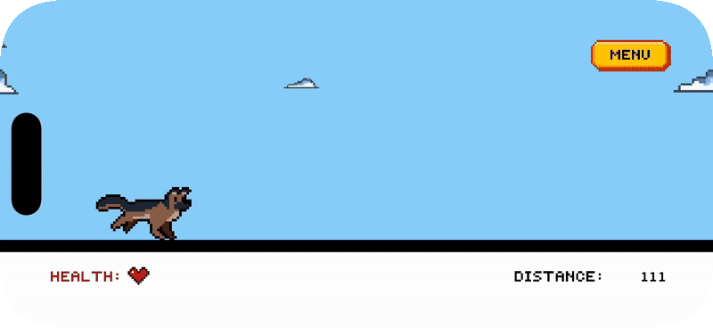

<h1 align="center">🐕 Zoomies</h1>

<p align="center">
  <b>A retro 2D endless runner built with SpriteKit + Swift 🕹️</b><br>
  Run, jump, collect bones, and survive as long as you can!
</p>

<p align="center">
  
  
  
  
</p>

---

## 🧠 Overview

**Zoomies** is a fast-paced pixel-art runner starring a German Shepherd 🐶.
Tap to jump, collect bones to restore health, and avoid obstacles to keep running!
Built entirely in **SpriteKit + Swift**, with custom pixel sprites and animations.

---

## 🎮 Gameplay Demo

### 🌅 Intro Scene  
<p align="center">
  <b>Our hero gets ready for a new adventure!</b><br><br>
  
</p>


### 🏃‍♂️ Gameplay  
<p align="center">
  <b>Dodge logs, collect bones, and keep running to survive!</b><br><br>
  
</p>


### 🎛️ Menu System  
<p align="center">
  <b>Pause, read the rules, or view the credits anytime.</b><br><br>
  
</p>


### 💀 Game Over  
<p align="center">
  <b>Every run must end — but you can always play again!</b><br><br>
  
</p>


---

## 🧰 Tech Stack

| Layer | Technology |
|:------|:------------|
| Engine | SpriteKit |
| Language | Swift |
| IDE | Xcode |
| Art | Custom Pixel Sprites (by Ritika) |
| Font | Press Start 2P |
| Platform | iOS |

---

## 👩‍💻 Credits

**Zoomies** by [Ritika Joshi](https://github.com/RJoshi141)
Game Design, Art & Code by Ritika
Built with SpriteKit + Swift ✨
© 2025 Zoomies Studio

---

## ⚙️ Setup (for Developers)

1. Clone the repository
   ```bash
   git clone https://github.com/RJoshi141/Zoomies.git
