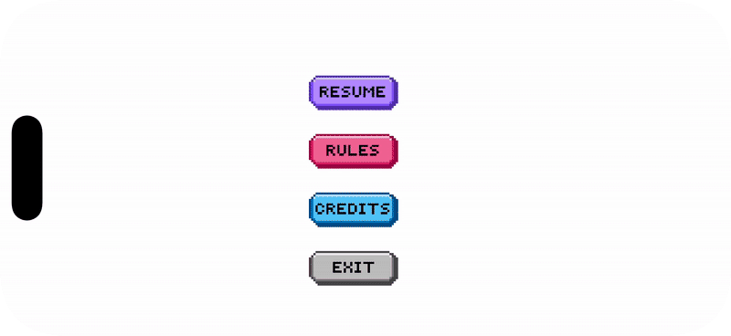

//
//  README.MD
//  Zoomies
//
//  Created by Ritika Joshi on 10/24/25.
//

<h1 align="center">🐕 Zoomies</h1>

<p align="center">
  <b>A retro 2D endless runner built with SpriteKit + Swift 🕹️</b><br>
  Run, jump, collect bones, and survive as long as you can!
</p>

<p align="center">
  
  
  
  
</p>

---

## 🧠 Overview

**Zoomies** is a fast-paced pixel-art runner starring a German Shepherd 🐶.
Tap to jump, collect bones to restore health, and avoid obstacles to keep running!
Built entirely in **SpriteKit + Swift**, with custom pixel sprites and animations.

---

## 🎮 Gameplay Demo

<p align="center">
  
  
  
  
</p>

---

## 🧩 Features

✨ **Custom Pixel Art**
- Sprites for running, jumping, sitting, barking, and collecting bones

❤️ **Health System**
- 5-heart health bar with bone-based recovery
- Animated blinking hearts on restart
- Skull icon when all hearts are lost 💀

🪵 **Obstacles + Power-ups**
- Dynamic log obstacles
- Random bone spawns (less frequent)

📏 **Distance Tracker**
- Real-time counter at the bottom-right of the screen

🖥️ **Menu Overlay**
- Resume, Rules, Credits, and Exit buttons
- Smooth transitions and back navigation

🎨 **Title & Credits Animations**
- Barking and sitting dog animations for extra charm

---

## 🧰 Tech Stack

| Layer | Technology |
|:------|:------------|
| Engine | SpriteKit |
| Language | Swift |
| IDE | Xcode |
| Art | Custom Pixel Sprites (by Ritika) |
| Font | Press Start 2P |
| Platform | iOS |

---

## 🕹️ Controls

| Action | Control |
|:-------|:---------|
| Jump | Tap anywhere on screen |
| Pause / Menu | Tap **MENU** (top-right) |
| Resume / Rules / Credits / Exit | Tap respective buttons |
| Restart | Tap **YES** after Game Over |
| Exit | Tap **NO** after Game Over |

---

## 👩‍💻 Credits

**Zoomies** by [Ritika Joshi](https://github.com/RJoshi141)
Game Design, Art & Code by Ritika
Built with SpriteKit + Swift ✨
© 2025 Zoomies Studio

---

## ⚙️ Setup (for Developers)

1. Clone the repository
   ```bash
   git clone https://github.com/RJoshi141/Zoomies.git
